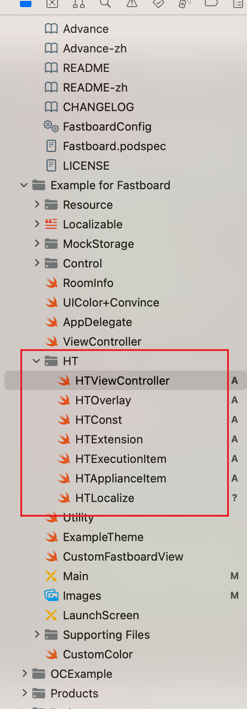

先 pod install.

第一次运行会有网络权限弹窗，同意后再次运行即可。

大部分的相关代码都在 HT 文件夹下面。

1. 在 Images 里设置 icon，比如 clean 图标，就是 whiteboard_clean 。比如 pencil 的选中图标，就是 whiteboard_pencil-selected 。图标是以 Bundle 形式查找的，Bundle 的设置代码在 HTViewController.swift 第 100 行。
2. 常量设置可以在 HTConst 里检查。
3. 按钮相关代码在 HTExecutionItem 和 HTApplianceItem 中。
4. 激光笔本地看不到，只会出现在远端。
